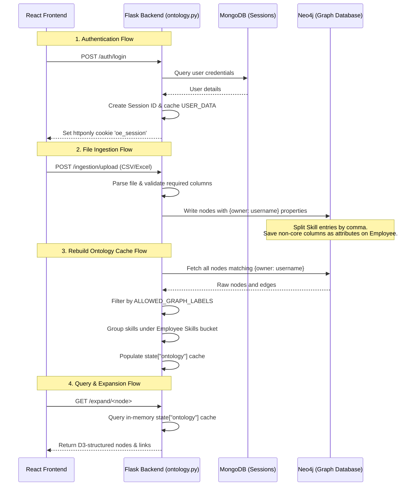

# Project Architecture and Modules

This document provides a detailed breakdown of the project architecture, explaining the frontend files, backend service layers, and the database flow.

---

## 1. Frontend Files (`src/` directory)

The frontend is a single-page React application built using Vite, styled with vanilla CSS, and powered by D3.js for interactive graph visualization.

### Entry Points & Routing
* **[main.jsx](file:///c:/Users/Administrator/Documents/Codex/2026-06-13/you-are-a-senior-frontend-engineer/src/main.jsx) & [App.jsx](file:///c:/Users/Administrator/Documents/Codex/2026-06-13/you-are-a-senior-frontend-engineer/src/App.jsx):** Set up the React component tree, load global CSS, and mount the main dashboard router. Manages user authentication state at the top level.

### Core React Components
* **[OntologyGraph.jsx](file:///c:/Users/Administrator/Documents/Codex/2026-06-13/you-are-a-senior-frontend-engineer/src/components/OntologyGraph.jsx):** The core visualization component. It uses **D3.js (Force-Directed Graph)** to render nodes and links.
  * Node colors and sizes are mapped dynamically based on node types (e.g., `Employee` is light blue, `Skill` is green, `Client` is orange).
  * Implements dynamic positioning, dragging, zoom/pan controls, and handles double-click events to expand/collapse nodes.
* **[DatasetFilters.jsx](file:///c:/Users/Administrator/Documents/Codex/2026-06-13/you-are-a-senior-frontend-engineer/src/components/DatasetFilters.jsx):** Renders the left sidebar search filter panels (Clients, Skills, Skill Groups, Bench Aging range slider, and the Campus/Lateral selector). It queries `/filter-options` on mount to populate valid values.
* **[Sidebar.jsx](file:///c:/Users/Administrator/Documents/Codex/2026-06-13/you-are-a-senior-frontend-engineer/src/components/Sidebar.jsx):** Displays the graph legend and detailed metadata inspector for the currently selected node (e.g., total connections, parent node, and attributes).
* **[SearchBar.jsx](file:///c:/Users/Administrator/Documents/Codex/2026-06-13/you-are-a-senior-frontend-engineer/src/components/SearchBar.jsx):** Provides an autocomplete search field to locate nodes in the active graph by label.
* **[IngestionPanel.jsx](file:///c:/Users/Administrator/Documents/Codex/2026-06-13/you-are-a-senior-frontend-engineer/src/components/IngestionPanel.jsx):** Handles drag-and-drop file uploads (CSV/Excel/JSON), triggers the schema validation pipeline, and tracks ingestion job progress.

### State & Hooks
* **[useOntologyExplorer.js](file:///c:/Users/Administrator/Documents/Codex/2026-06-13/you-are-a-senior-frontend-engineer/src/hooks/useOntologyExplorer.js):** The primary custom hook managing the application state (graph data, filters, search query, loading/error flags, search results, and node history stack for forward/backward navigation).

### API Services
* **[ontologyApi.js](file:///c:/Users/Administrator/Documents/Codex/2026-06-13/you-are-a-senior-frontend-engineer/src/services/ontologyApi.js):** Outlines asynchronous AJAX request wrappers for backend endpoints (`/expand`, `/employees`, `/filter-options`, etc.) using native `fetch`. It includes `credentials: 'include'` to pass HTTP session cookies.

---

## 2. Backend Files

The backend is built in Python using the Flask micro-framework, communicating with MongoDB for metadata and session management, and Neo4j for graph storage.

### Core Application
* **[ontology.py](file:///c:/Users/Administrator/Documents/Codex/2026-06-13/you-are-a-senior-frontend-engineer/ontology.py):** Contains the entire backend system:
  * **Session Handler:** Authenticates logins and generates session cookies (`oe_session`).
  * **Ingestion Logic:** Parses uploaded spreadsheets using Pandas, verifies mandatory columns (`Emp_Name`, `Client_Name`, etc.), and passes data to database drivers.
  * **User State Manager (`USER_DATA`):** Caches in-memory graph ontologies partitioned by username to isolate tenant data.
  * **Cypher Query Generators:** Formulates queries to update and query Neo4j node structures.
  * **REST APIs:** Exposes endpoints for authentication, uploads, search queries, node rename overrides, and graph expansion paths.

### Dev Tooling
* **[dev.mjs](file:///c:/Users/Administrator/Documents/Codex/2026-06-13/you-are-a-senior-frontend-engineer/scripts/dev.mjs):** A Node.js manager script that spins up both the Flask backend server (port `5011`) and the Vite development server (port `5174`) in parallel.

---

## 3. Database Flow

The system orchestrates operations across MongoDB and Neo4j to enforce strict user isolation and a clean visual presentation.

### 1. Ingestion Pipeline
1. **Spreadsheet Upload:** The user uploads a spreadsheet. Flask parses it into a Pandas DataFrame.
2. **Schema Splitting:** For the `Skills` and `misc skill` columns, entries (like `Python, React`) are split by comma. Each part is processed as an individual, unique `Skill` node to prevent concatenated duplicate options.
3. **Attribute Reduction (Keep Graph Clean):** Unwanted columns (such as `Mobile`, `BenchAging`, `Utilization`, `LHFunction`, and `CampusLateral`) do not generate nodes or edges. Instead, they are saved directly as properties on the `Employee` node.
4. **Ownership Tagging:** Every node and relationship merged into Neo4j is tagged with the property `owner: username` to ensure data isolation.

### 2. Cache Rebuild Flow
1. **Fetch from Neo4j:** When a user logs in or re-uploads a dataset, `load_graph_dataset_from_neo4j` queries all elements owned by the active user.
2. **Strict Allow-List Filtering:** Nodes are filtered against `ALLOWED_GRAPH_LABELS = {"Employee", "Client", "Project", "Skill", "Department", "Level", "Module", "SkillGroup"}`. Any other legacy or attribute nodes are ignored.
3. **Skills Bucketing (Clutter Prevention):** The backend groups all of an employee's skills under a single intermediate `f"{EmployeeName} Skills"` bucket node (type `SkillGroup`). 
4. **Cache Storage:** The structured graph is cached in memory under `USER_DATA[username]["ontology"]`.

### 3. Frontend Visualization rendering
1. **Endpoint Request:** The frontend requests `/expand/<node>`.
2. **Neighbor Resolution:** The backend reads the node's neighbors from `USER_DATA[username]["ontology"]`.
3. **Display Labels Mapping:** The API maps node IDs to display labels using `user_label()`. It automatically changes any `{EmployeeName} Skills` node ID to show simply as **`"Skills"`** on the screen.
4. **D3 Rendering:** The frontend D3 engine renders the centered node. When expanding an employee, it displays a single **`Skills`** group node, which spreads out into individual skill nodes (Python, React, etc.) only when double-clicked.
